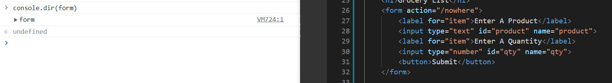
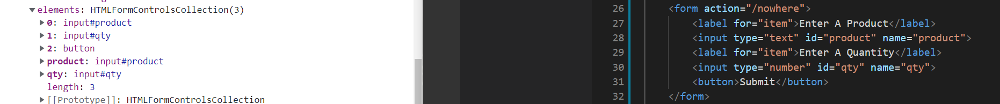

 We can access the collection of thr <form> elements using 'elements' property by typing 'console.dir(form)' in the dev tools console:

Here we can access, for example,  <input type="text" id="product" name="qty"> 
by the following: form.elements.qty.value

